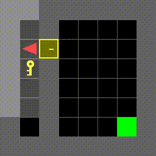

# PPO with Self-Imitation Learning

Implementation of Proximal Policy Optimization enhanced with Self-Imitation Learning for improved sample efficiency in sparse reward environments. This project combines the stability of PPO with SIL ability to learn from past successful experiences through prioritized replay, tested on MiniGrid environments.


<div align="center">
  
  <br>
  <em>Trained agent with SIL solving MiniGrid-DoorKey-8x8-v0</em>
</div>

## Project Overview

**Research Question**: Can the integration of experience replay buffers or
intrinsic reward mechanisms improve the sample efficiency of PPO in sparse-reward environments
such as MiniGrid?

**Key Features**:
- Standard PPO implementation with actor-critic architecture
- Self-Imitation Learning with prioritized experience replay
- Adaptive success threshold mechanism

- Multi-seed evaluation for statistical robustness
- MiniGrid environment integration

## Quick Setup

### 1. Environment Setup
```bash
python -m venv venv
venv\Scripts\activate  # Windows
source venv/bin/activate  # Linux/Mac
```

### 2. Install Dependencies
```bash
pip install -r requirements.txt
```

### 3. Optional: Setup Weights & Biases
```bash
wandb login
wandb login --relogin
```

## Usage

### Basic Training (PPO only)
```bash
python train.py --gym-id MiniGrid-DoorKey-8x8-v0 --total-timesteps 1000000
```

### Training with SIL Enhancement
```bash
python train.py --sil true --gym-id MiniGrid-DoorKey-8x8-v0 --total-timesteps 1000000
```

### Full Experiment with Multiple Seeds
```bash
python train.py --sil true --track --tensorboard --total-timesteps 1000000 --seeds 0 1 2 3 4 5 6 7 8 9
```

### Hyperparameter Tuning Example
```bash
python train.py --sil true --sil-lr 1e-4 --sil-buffer-size 10000 --success-threshold 0.8
```

## Configuration Parameters

### Core Training
- `--total-timesteps`: Training duration (default: 1000000)
- `--learning-rate`: PPO learning rate (default: 1e-4)
- `--rollout-size`: Rollout buffer size (default: 1024)
- `--batch-size`: Mini-batch size (default: 64)
- `--seeds`: Random seeds for evaluation (default: [0,1,2,3,4,5,6,7,8,9])

### PPO Specific
- `--gamma`: Discount factor (default: 0.99)
- `--gae-lambda`: GAE lambda (default: 0.95)
- `--clip-coef`: PPO clip ratio (default: 0.14)
- `--ent-coef`: Entropy coefficient (default: 0.01)
- `--vf-coef`: Value function coefficient (default: 0.5)

### SIL Specific
- `--sil true/false`: Enable/disable Self-Imitation Learning
- `--sil-lr`: SIL learning rate (default: 1e-4)
- `--sil-buffer-size`: SIL replay buffer size (default: 10,000)
- `--sil-batch-size`: SIL batch size (default: 32)
- `--sil-update-ratio`: SIL updates per PPO update (default: 4)
- `--success-threshold`: Success threshold for SIL buffer (default: 0.8)
- `--sil-warmup-episodes`: Episodes before SIL starts (default: 50)

### Environment & Logging
- `--gym-id`: MiniGrid environment (DoorKey-8x8-v0)
- `--track`: Enable WandB logging
- `--tensorboard`: Enable TensorBoard logging

## Project Structure

```
├── train.py              # Main training script
├── agent.py              # Base PPO agent implementation
├── sil_agent.py          # PPO+SIL agent implementation
├── sil_buffer.py         # Prioritized SIL replay buffer
├── buffer.py             # PPO rollout buffer
├── network.py            # Actor-critic neural network
├── logger.py             # WandB and TensorBoard logging
├── utils.py              # Seed function
├── plot.py               # Plotting and visualization
├── results/              # Training results (JSON)
├── models/               # Saved model checkpoints
├── videos/               # Episode recordings
└── runs/                 # TensorBoard logs
```

## Results

Based on our experiments on MiniGrid-DoorKey environments:

- **Sample Efficiency**: PPO+SIL achieves ~50% higher success rates vs vanilla PPO
- **Convergence Speed**: ~30% faster convergence to stable performance
- **Final Performance**: Success rates improve from 0.65 (PPO) to 0.82 (PPO+SIL)
- **Episode Efficiency**: 15-20% shorter successful episodes

## Monitoring Training

### View TensorBoard Logs
```bash
tensorboard --logdir runs/
```

### Generate Learning Curves
```bash
python plot.py
```

### Check WandB Dashboard
Visit WandB project page after running with `--track`

## Output Files

Results are automatically saved to:
- `results/`: JSON files with learning curves and statistics
- `models/`: PyTorch model checkpoints with configuration
- `videos/`: Recordings of agent episodes (every 250 episodes)
- `runs/`: TensorBoard event files for visualization


### Performance Tips
- Use `--rollout-size 2048` for better sample efficiency (requires more memory)
- Start with smaller environments (`DoorKey-8x8-v0`) before scaling up
- Use multiple seeds for robust evaluation: `--seeds 0 1 2 3 4`


## Environments Tested

- **MiniGrid-DoorKey-6x6-v0**: Basic key collection and door opening
    - PPO without SIL was able to solve the env
- **MiniGrid-DoorKey-8x8-v0**: Larger environment with increased complexity
    - Vanilla PPO could not solve it
    - PPO with SIL solved it
- **Other variations**: Lava Gap and Empty were easy for PPO

## Code
This code is inspired by

- [Huggingface PPO code](https://huggingface.co/learn/deep-rl-course/unit8/hands-on-cleanrl)

## References

- [Proximal Policy Optimization](https://arxiv.org/abs/1707.06347)
- [Self-Imitation Learning](https://proceedings.mlr.press/v80/oh18b.html)
- [MiniGrid Environments](https://github.com/Farama-Foundation/MiniGrid)
